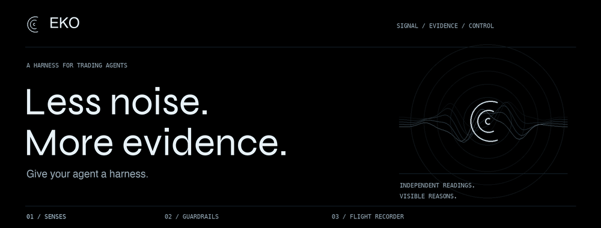

<p align="center">
  
</p>

<p align="center">
  <a href="LICENSE"></a>
  <a href="package.json"></a>
  <a href="pnpm-lock.yaml"></a>
  <a href="docs/PUBLIC_HISTORY.md"></a>
  <a href=".github/workflows/ci.yml"></a>
</p>

# Give your agent a harness.

EKO puts checks and a record around trading agents. It brings market context, order policies,
approvals and a private decision journal into one workspace, with a terminal built on Robinhood Chain
for the human supervising the agent.

**Less noise. More evidence.** A verdict is useful when you can inspect its reasons, the data behind it
and what happened next. EKO is built around that loop.

## What is in the box?

| Layer | What you can explore in this source |
| --- | --- |
| **Senses** | Chain ingestion, normalized coin cards, wallet labels, rule-based scam playbooks and market context |
| **Guardrails** | Preflight policy checks, trade simulation, approval flows and execution constraints |
| **Flight Recorder** | Private agent journals, decision records and receipt pipelines |
| **Mission Control** | A React terminal for reviewing signals, agents, positions and decisions |
| **Agent interface** | An MCP service, authentication and agent-key workflows |

This is a **development snapshot**, with simulated data enabled for local exploration. Source presence
does not establish a production launch, completed contract review, live integration or measured accuracy.
Production mode defaults to the `onchain` market-data source, which serves chain-derived records the
indexer writes to Postgres; without a running indexer its markets are empty. Select
`MARKET_DATA_SOURCE=demo` for a production-style demo with simulated data.

Brokerage-connected agent checks are advisory. The agent must call them, and the brokerage's own
trade approvals remain the enforced stop. The source also contains on-chain execution components;
evaluate their configuration and review status before using real funds. A Clear verdict is a revocable
assessment, never a promise about a token or an outcome.

## Run it locally

Install **Node.js 22.12 or newer** and **pnpm 11.5.1**, then run from the repository root:

```sh
pnpm install --frozen-lockfile
pnpm dev:demo
```

Open the terminal at **http://localhost:5180**. The API listens at **http://localhost:8710**.
The local demo uses development fixtures and embedded PGlite; it does not require a wallet or real keys.
For configuration examples, see [`.env.example`](.env.example). Copy it to `apps/server/.env` only when
you need overrides, and keep that file local.

`pnpm dev` starts the API and web app with the default simulated-data configuration.
The separate marketing landing project is optional: set `EKO_SITE` to its directory to serve it at `/`.
Without it, the web app provides the local entry point. The marketing project is not included here.

```sh
pnpm typecheck
pnpm test
pnpm brand:check
pnpm build
python3 scripts/test-public-guard.py
```

Maintainers with the private guard key can run `python3 scripts/public-guard.py --mode history`.
Fresh clones and fork pull requests do not receive that key; the full identity check fails closed
until a maintainer provides it. See [the guard prerequisites](docs/PUBLIC_HISTORY.md).

## Find your way around

| Path | Purpose |
| --- | --- |
| [`apps/web`](apps/web) | React 19 / Vite terminal and interface tests |
| [`apps/server`](apps/server) | Fastify API, account flows, read models and execution services |
| [`apps/indexer`](apps/indexer) | Block/log ingestion, catch-up and chain-derived records |
| [`apps/engines`](apps/engines) | Scan workers, simulations and evaluations |
| [`apps/mcp`](apps/mcp) | MCP transport and tools |
| [`apps/bots`](apps/bots) | X and Farcaster summon bots (transports off by default) |
| [`apps/og-renderer`](apps/og-renderer) | Deterministic PNG share cards |
| [`packages`](packages) | Shared contracts, chain tools, database, policies, playbooks and signal engines |
| [`contracts`](contracts) | Solidity source and contract tests; third-party libraries retain their licenses |
| [`infra`](infra) | Deployment role definitions, monitoring and backup examples |
| [`docs`](docs) | Product spec ([`docs/eko`](docs/eko)), security model and invariants, operations runbooks, task packets and reports |
| [`.audit-grade`](.audit-grade) | The latest audit-grade report, findings ledger and score history |

TypeScript ties the workspace together. Postgres/Drizzle, PGlite, viem, wagmi and TradingView
Lightweight Charts support the data and terminal layers. Dependencies are pinned in the lockfile.

## Audit and live staging

[`.audit-grade/REPORT.md`](.audit-grade/REPORT.md) is the latest audit-grade report; its findings ledger and
score history sit beside it. Commit hashes in those files and in the operations evidence refer to the
source repository; [`docs/EXPORT.md`](docs/EXPORT.md) maps each synced source revision to its public commit.

Staging runs at **https://app.staging.ekoterminal.com** with live trading off. `/v1/build` reports the public
commit it was built from, its bundle digests and its non-secret configuration digest; from a checkout of that
commit, `node scripts/verify-staging-identity.mjs <origin> --revision <sha>` checks them read-only.

## A transparent public history

The **371 commits dated June 25–October 2, 2026 are reconstructed component imports** from a current
source snapshot. The late-June start reflects the owner's reported development period. These are
not the original contemporaneous commits, and their displayed dates are not evidence of when any
specific component was built. Every commit includes a reconstruction trailer.

Commits after the reconstruction are genuine updates with their real dates. Each one syncs the public tree
to a newer source revision, now including the project documentation, task reports and audit record.

Read [the history disclosure](docs/PUBLIC_HISTORY.md) and [export scope](docs/EXPORT.md) before treating
the timeline as project provenance. Neutral commit identities and content guards do not hide the GitHub
account or authenticated activity.

## License and contributions

EKO-owned code is **source-available for noncommercial purposes** under the
[PolyForm Noncommercial License 1.0.0](LICENSE). It is not an unrestricted commercial-use license.
Third-party code and fonts retain their own terms; see [`NOTICE`](NOTICE) and the license files alongside them.

Issues and focused pull requests are welcome. Describe the behavior you changed and the checks you ran.
Follow [`AGENTS.md`](AGENTS.md), preserve privacy and notices, and use synthetic examples.
For sensitive findings, follow [`SECURITY.md`](SECURITY.md).

AI-generated analysis. Not financial advice. Do your own research.
Built on Robinhood Chain. Not affiliated with, endorsed by, or officially connected with Robinhood Markets, Inc.
